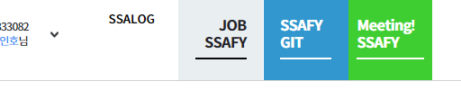
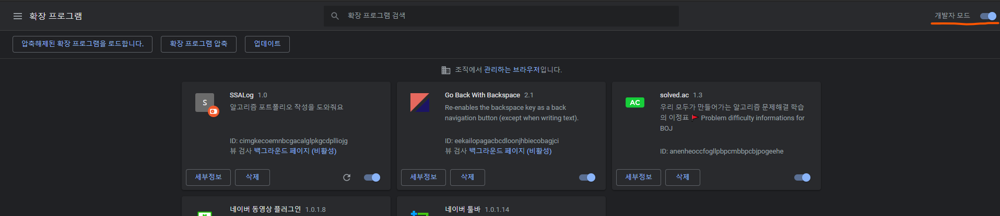
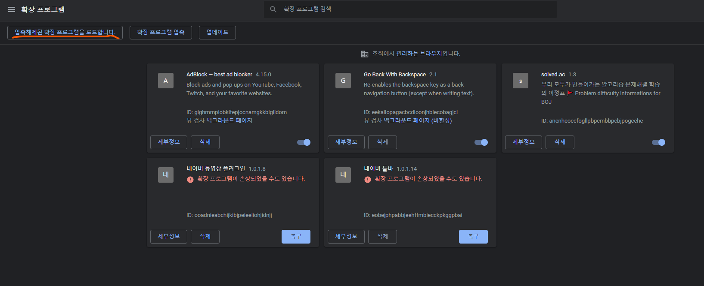
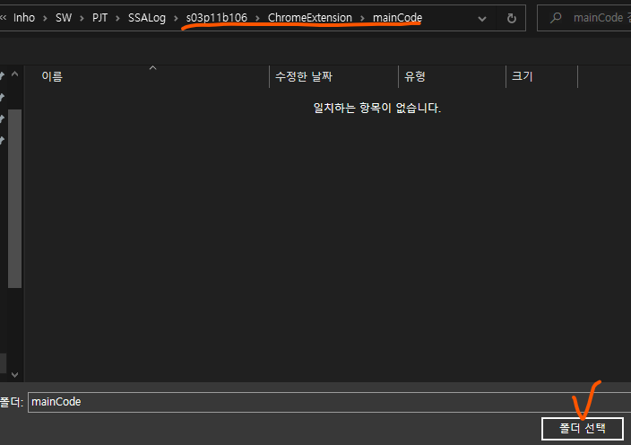
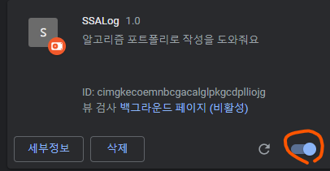
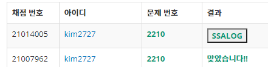
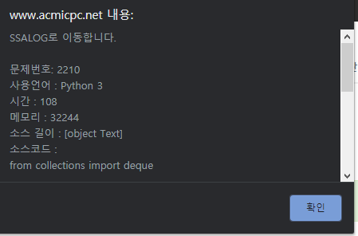

# Chrome Extenison

작성자 : 김인호

## 🍕개요

백준에서 문제를 풀고 성공하면 작성한 소스코드, 코드의 속성(시간, 메모리 등)의 데이터를 우리측 서버로 옮겨주는 역할을 한다.
아직은 AWS 서버가 구현되지 않아 제한된 기능만 작동됨

ssafy생들이 적극 활용할 수 있도록 edu_ssafy에 버튼 추가(방금 추가한거라 오류 발생 가능)

## 🚀QuickStart(설치법)

1. 크롬 확장프로그램 탭에 접속

2. 

   우측 상단 개발자 모드 활성화

3. 

   왼쪽 위 버튼 클릭

4. 

   /ChromeExtension/maincode 디렉토리 확인 후 **폴더선택** 클릭

5. 

   활성화 상태 확인

## 📌how to use

1. 백준 사이트 접속https://www.acmicpc.net/

2. 아무 문제나 푼다. (이미 푼 문제 다시 제출하면 테스트하기 수월할 것)

3. 

   성공하면 버튼 바뀌는지 확인 (새로고침 하지 말아주세요)

4. 

   버튼 눌렀을 때 다음과 같은 메시지가 뜨면 성공

## 🧱dummy

example code 에는 생활코딩에서 공부한 확장프로그램 예제가 있다.

생활코딩 https://opentutorials.org/course/2897/14051 참조

BOJ에서, 알고리즘문제에 코드를 입력하고 제출 버튼을 누르면 storage로 코드를 일시적으로 저장해온다.

성공하였다는 메시지가 뜨지 않으면 저장한 코드 삭제

성공하였습니다. 메시지가 뜨면 push알림(작게 뜨는 알림 메시지)가 아이콘으로 뜬다.

저장된 코드 + 종합적 결과(시간, 메모리 등)를 가지고...

webDRM 에 의해 썰리지 않아야 한다.

비활성화 기능을 넣어주자

문제 풀었는지 판단

isSubmit 이 true 이면 풀었다고 판단

그럼 이 flag 를 언제 빼버리느냐,

새로고침 해서 빼버리면 바로 걍 날아가게 된다.

틀렸다면 소스코드 파기, 플레그 파기

마지막으로 푼 문제인지 일치하면 그걸 걍 띄워놓으면 되지 않을까

배포단계에서는 https://www.youtube.com/watch?v=jBSTPdCfUUw 참조

### 작성한 소스 긁어오기

내소스보기> 성공했습니다 > 버튼 생성 > 백그라운드로 탭 오픈 > isCrawl 확인 > true이면 내부 소스 긁고 storage저장 > 탭닫기 > 메세지(신호) 보내기 > 신호 받으면 스토리지 저장된거 활용

### 페이지 내에서성공한 소스 긁어오기

status 항목에서 성공했습니다 로 판단할 시, 다른사람이 푼것도 접근가능하게 되어버린다.

내가 푼코드만(내 소스) 에서만 작동되도록 해야할 것

방법 : tr 항목마다 내 id가 있다. 그것으로 식별가능할 듯

아이디가 내아이디와 같은가X from_mine=1 로 확인하자 && 맞았습니다.(클래스 확인) 인가 > 해당 소스 긁어오기 고고

어떻게 가져오는게 더 안정적일까

solved[0].parentElement.parentElement.firstChild.innerText 로 제출번호 알수있다.

urlSearchParams 로 쿼리스트링 받아올 수 있음

